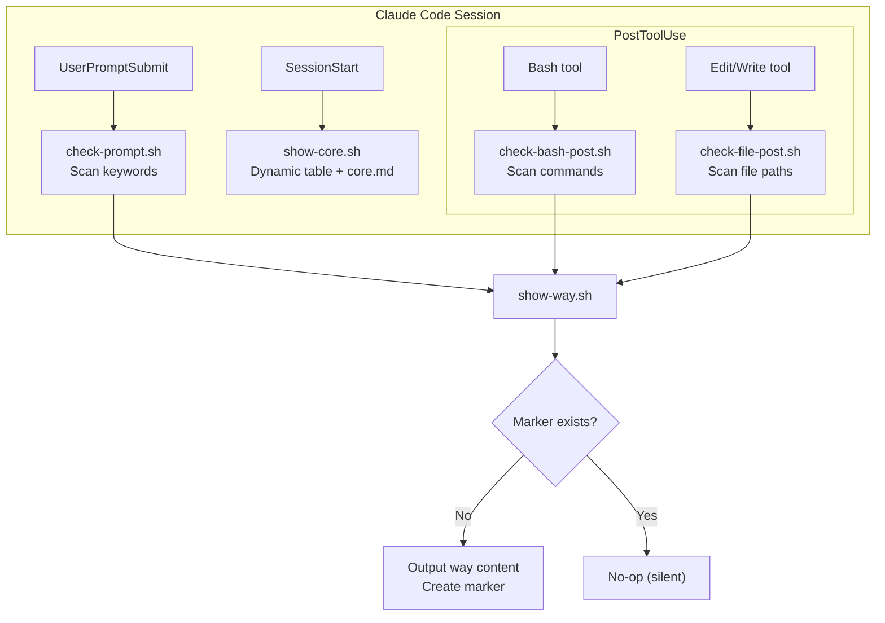
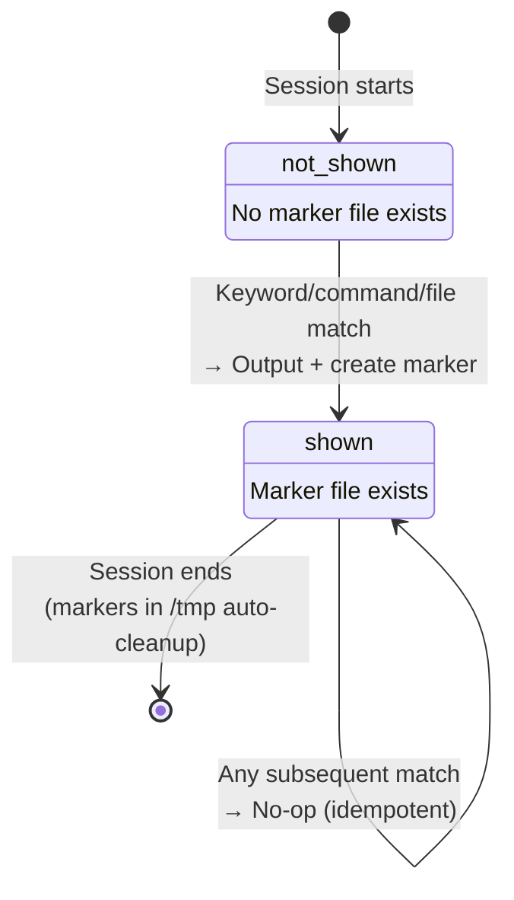
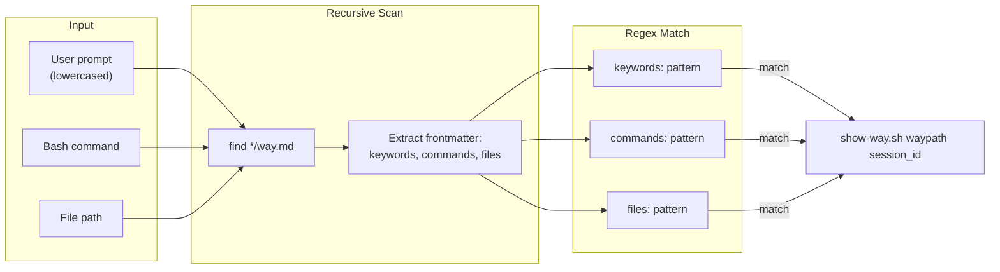
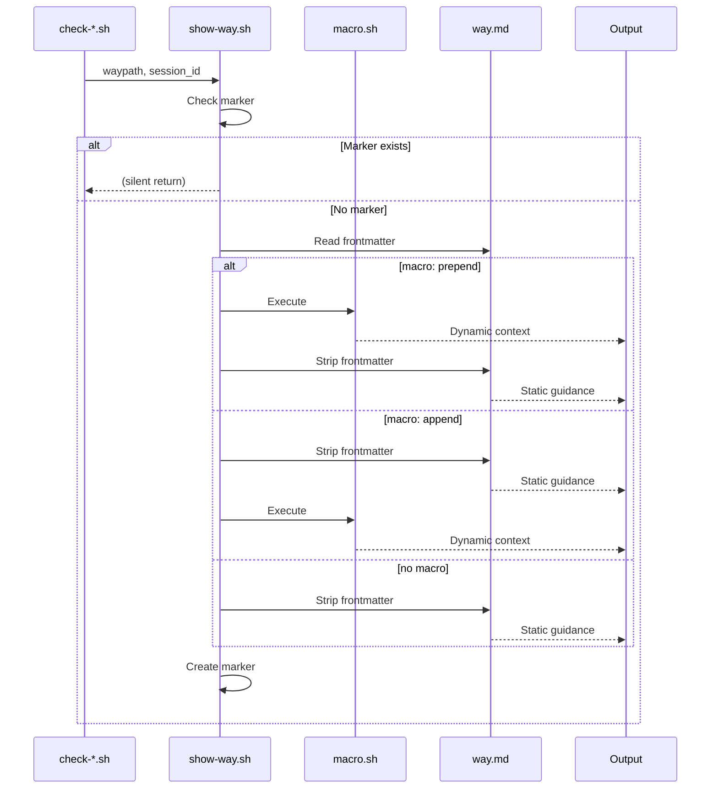
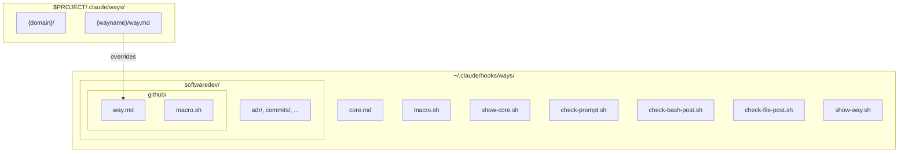
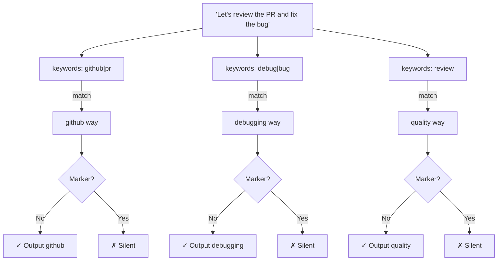
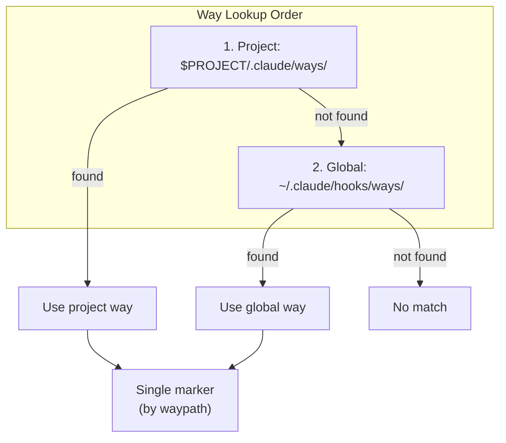

# Ways System Architecture

Visual documentation of the ways trigger system.

## Hook Flow

How ways get triggered during a Claude Code session:

## Way State Machine

Each (way, session) pair has exactly two states:

## Trigger Matching

How prompts and tool use get matched to ways:

## Macro Injection

Ways with `macro: prepend|append` run dynamic scripts:

## Directory Structure

## Multi-Trigger Semantics

What happens when multiple triggers fire:

Each way has its own marker - multiple ways can fire from one prompt, but each only fires once per session.

## Project-Local Override

Project ways take precedence. Only one marker per waypath regardless of source.
