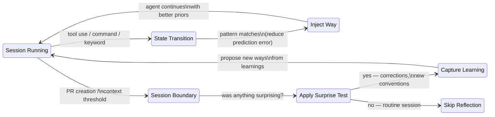

# Design Rationale: Why Ways Work This Way

Ways are a surprise management system. This document explains the cognitive science and practical reasoning behind the design -- not as academic argument, but as shared context for anyone maintaining or extending the system.

## The Core Thesis

Intelligence -- biological or artificial -- is fundamentally about managing surprise. An agent that predicts well acts well. When predictions fail, something interesting is happening: a convention was unknown, a pattern was unexpected, a decision was non-obvious.

We built ways around this insight. The system does two things:

1. **Reduces prediction error** by injecting relevant context at the moment of action -- before the agent encounters something it would otherwise get wrong.
2. **Uses surprise as the learning signal** by capturing new knowledge only when something unexpected happened in a session.

This isn't metaphorical. The hook system literally monitors for state transitions (tool use, commands, file edits) where prediction error is likely to spike, and injects priors that reduce it. The introspection system literally asks "was anything surprising?" and skips the entire reflection process if the answer is no.

Everything else in this document unpacks that core idea.

## Why Not a Giant CLAUDE.md

The obvious alternative to event-driven injection is to put everything in one big instruction file. We tried that. Here's why it doesn't work:

### Lost in the Middle

Liu et al. (2023) demonstrated a U-shaped attention curve in language models: information at the beginning and end of context gets used reliably, but content in the middle suffers 20%+ performance degradation. A monolithic instruction file pushes most of its content into this dead zone. Worse, as context windows grow larger, the dead zone grows with them -- more capacity doesn't fix the problem, it can exacerbate it.

Event-driven injection sidesteps this entirely. Each way is small (typically 20-60 lines) and lands at a high-attention position -- the most recent content in the context window at the moment it's needed.

### Context as Scarce Resource

Every token in the context window has an opportunity cost. Tokens spent on "just in case" instructions are tokens unavailable for the actual work -- code, conversation history, file contents. Sweller's Cognitive Load Theory calls this extraneous load: information that's present but not contributing to the task at hand.

Shi et al. (2023) showed this isn't just theoretical waste -- irrelevant context actively degrades reasoning even when the relevant information is also present. A 500-line CLAUDE.md that's always loaded means the model is always doing extra work filtering signal from noise.

### Just-in-Case is Waste

The Toyota Production System recognized decades ago that inventory sitting "just in case" is waste -- it costs resources to maintain, ages, and obscures what's actually needed. The same principle applies here. A commit message format reminder that's always present is waste during a debugging session. Security guidance is noise when writing documentation.

We borrow from the same tradition as lazy loading, event-driven architecture, and YAGNI: don't pay for what you're not using.

### Attention and Salience

Signal detection theory tells us that signal-to-noise ratio degrades as the total signal grows. Simons and Chabris (1999) demonstrated inattentional blindness -- stimuli that are clearly present get missed when attention is directed elsewhere. A 50-line testing way that appears when you run `pytest` has vastly higher salience than the same 50 lines buried in a 500-line always-present file.

Notification design research confirms the corollary: interruptions are most effective at natural breakpoints and task transitions, not as continuous background presence.

## Cognitive Science Foundations

The ways architecture draws on four research traditions. We're not implementing these theories academically -- we're using them as design lenses that explain why certain choices work better than alternatives.

### Active Inference and the Free Energy Principle

**Core idea:** Intelligent agents minimize surprise (technically: variational free energy) through a combination of prediction and action. The brain continuously generates predictions about incoming signals and acts to reduce the gap between prediction and reality (Friston, 2010).

**How it maps to ways:** Hook-based injection is analogous to precision-weighting -- increasing the gain on relevant prediction error at the right moment. When a way fires at `git commit`, it's the system saying "this is a moment where prediction accuracy matters, here's a high-precision prior." Loading everything upfront treats all information as equally precise at all times, which is computationally wasteful and informationally meaningless.

### Predictive Processing

**Core idea:** The brain operates as a hierarchical prediction machine. Only prediction errors propagate upward through the hierarchy; correct predictions are silently confirmed. Cognition is largely about generating and refining top-down predictions (Clark, 2016; Rao & Ballard, 1999).

**How it maps to ways:** Context injection isn't just information delivery -- it's precision-weighting. The same guidance text has different cognitive impact depending on when it arrives. "We use conventional commits" landing at the moment of `git commit` functions as a high-precision prior because it's directly applicable. The same text loaded at session start has lower precision -- it's potentially relevant to something that may or may not happen.

### Situated and Embodied Cognition

**Core idea:** Cognition is shaped by the environment and what's immediately available. The mind extends into tools, notebooks, and environmental structures that participate in the cognitive process (Hutchins, 1995; Clark & Chalmers, 1998; Suchman, 1987).

**How it maps to ways:** The hooks directory is a cognitive scaffold -- an external structure that participates in the agent's cognitive process. This is a direct implementation of the extended mind thesis: the agent's effective knowledge includes not just its weights and context window, but the ways directory that feeds relevant information at appropriate moments. The reliability of this coupling matters -- hooks must fire consistently, or the agent loses trust in the scaffold and falls back to less effective strategies.

### Relevance Realization

**Core idea:** The fundamental cognitive challenge is determining what's relevant from a combinatorially explosive space of possibilities. Organisms solve this through evolved and learned mechanisms that constrain attention (Vervaeke et al., 2012; Sperber & Wilson, 1986).

**How it maps to ways:** Trigger patterns are pre-computed relevance judgments. Instead of the agent spending context tokens figuring out which of dozens of possible conventions apply to the current task, the hook system has already encoded that judgment in regex patterns, file globs, and command matchers. The timing and selection of what gets injected communicates designer intent about what matters for a given action.

### Principles-to-Design Mapping

| Principle | Source | Ways Implementation |
|-----------|--------|-------------------|
| Inject at state transitions where prediction error spikes | Active Inference | Hooks fire at tool use, session start, context thresholds |
| Context is precision-weighting, not just information | Predictive Processing | Same guidance has different impact based on when it arrives |
| Offload to environment, don't overload working memory | Situated Cognition | Hooks directory as external cognitive scaffold |
| Pre-compute relevance | Relevance Realization | Trigger patterns encode relevance judgments |
| Maximize signal-to-noise | Signal Detection Theory | Small targeted injections vs. monolithic prompt |
| Deliver at natural breakpoints | Interruption Science | PreToolUse, UserPromptSubmit as task transition points |
| Surprise is the learning signal | Predictive Processing | Escape hatches: capture only what was surprising |

## The Surprise Test

Surprise is the unifying principle of the system. It governs both directions of the knowledge loop:

**As trigger for injection:** When the agent is about to do something where it might get surprised -- committing code, editing config files, running tests -- the hook system fires and injects guidance. The trigger patterns encode our prediction about when surprise is likely. We don't inject testing guidance during documentation work because there's no prediction error to reduce.

**As escape hatch for reflection:** At session boundaries (PR creation, context threshold), the introspection system asks: was anything surprising? If the human didn't correct anything, didn't explain any conventions, didn't push back on any choices -- then the session went as predicted and there's nothing to capture. This prevents ceremony for ceremony's sake. The Memory Way and Introspection Way both gate on this same test.

The beauty of this dual role is that it's self-calibrating. A system that captures everything produces noise. A system that captures nothing loses knowledge. Surprise is the signal that distinguishes the two -- it marks exactly the moments where the agent's model of the world was wrong and needs updating.

## Simple Mechanisms, Effective Results

The implementation uses deliberately simple detection mechanisms:

- **Regex matching** for keywords, commands, and file patterns
- **Gzip-based Normalized Compression Distance (NCD)** for semantic similarity
- **Keyword counting** with stopword filtering for domain vocabulary

There are no embedding models, no vector databases, no neural classifiers in the core matching pipeline. The semantic matcher works by comparing gzip compression ratios -- if two texts share patterns, compressing them together produces smaller output than expected from their individual sizes. It's an information-theoretic measure that runs in milliseconds with zero dependencies beyond `gzip` and `bc`.

This simplicity is a feature, not a limitation. It's evidence of a design principle: **well-calibrated timing beats sophisticated detection**.

The matching doesn't need to be perfect. It needs to be good enough to fire at roughly the right moment, because the value comes from the architecture -- delivering small, relevant context at state transitions -- not from the precision of the trigger. A regex that fires on `git commit|git push|conventional` doesn't need to understand natural language. It needs to reliably detect the neighborhood of an action where commit guidance is useful.

When higher precision is needed, the system offers a model-based classifier (Haiku) as an opt-in upgrade, adding ~800ms of latency for more accurate classification. But most ways work fine with regex, and that tells us something important about where the leverage actually is.

The matching tiers, in practice:

| Mechanism | Latency | Accuracy | When We Use It |
|-----------|---------|----------|----------------|
| Regex | < 1ms | High for known patterns | Most ways -- keywords, commands, file paths |
| NCD + keywords | ~5ms | Good for semantic neighborhood | Ways where exact keywords aren't predictable |
| Model (Haiku) | ~800ms | High for ambiguous intent | Security-sensitive, high-stakes triggers |

## References

- Brown, J. S., Collins, A., & Duguid, P. (1989). Situated cognition and the culture of learning. *Educational Researcher*, 18(1), 32-42.
- Clark, A. (2016). *Surfing Uncertainty: Prediction, Action, and the Embodied Mind*. Oxford University Press.
- Clark, A., & Chalmers, D. (1998). The extended mind. *Analysis*, 58(1), 7-19.
- Friston, K. (2010). The free-energy principle: a unified brain theory? *Nature Reviews Neuroscience*, 11(2), 127-138.
- Godden, D. R., & Baddeley, A. D. (1975). Context-dependent memory in two natural environments: on land and underwater. *British Journal of Psychology*, 66(3), 325-331.
- Hutchins, E. (1995). *Cognition in the Wild*. MIT Press.
- Liu, N. F., et al. (2023). Lost in the middle: How language models use long contexts. *arXiv:2307.03172*.
- Ohno, T. (1988). *Toyota Production System: Beyond Large-Scale Production*. Productivity Press.
- Rao, R. P. N., & Ballard, D. H. (1999). Predictive coding in the visual cortex. *Nature Neuroscience*, 2(1), 79-87.
- Shi, F., et al. (2023). Large language models can be easily distracted by irrelevant context. *Proceedings of ICML 2023*.
- Simons, D. J., & Chabris, C. F. (1999). Gorillas in our midst. *Perception*, 28(9), 1059-1074.
- Sperber, D., & Wilson, D. (1986). *Relevance: Communication and Cognition*. Harvard University Press.
- Suchman, L. A. (1987). *Plans and Situated Actions*. Cambridge University Press.
- Sweller, J. (1988). Cognitive load during problem solving. *Cognitive Science*, 12(2), 257-285.
- Vervaeke, J., Lillicrap, T. P., & Richards, B. A. (2012). Relevance realization and the emerging framework in cognitive science. *Journal of Logic and Computation*, 22(1), 79-99.
- Vygotsky, L. S. (1978). *Mind in Society: The Development of Higher Psychological Processes*. Harvard University Press.
